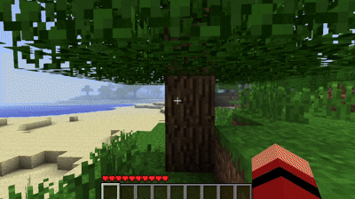
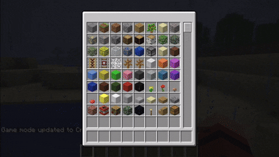
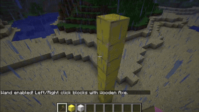
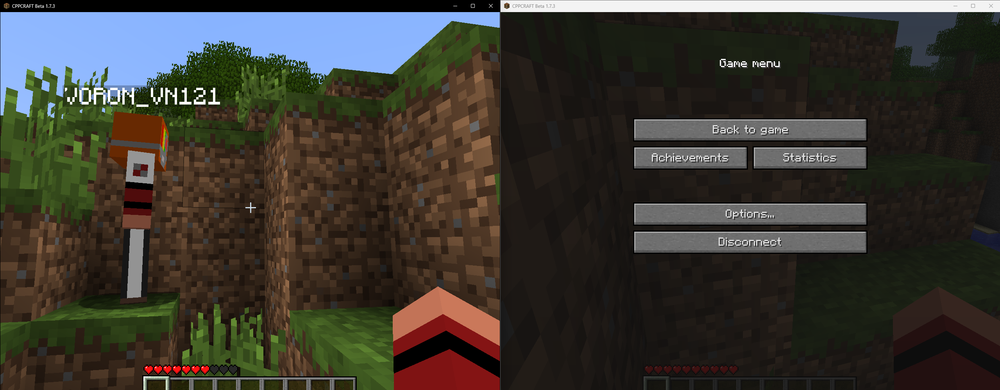
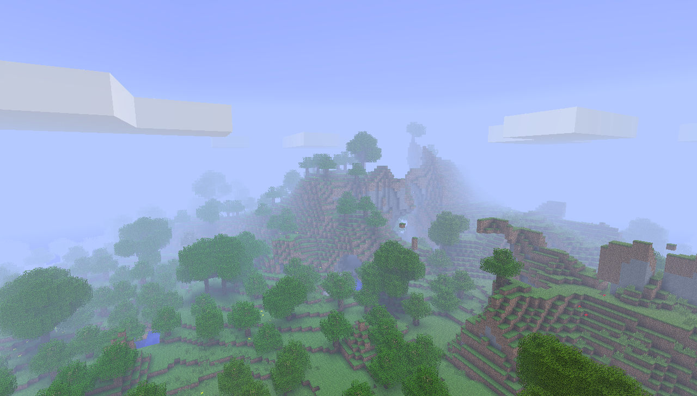
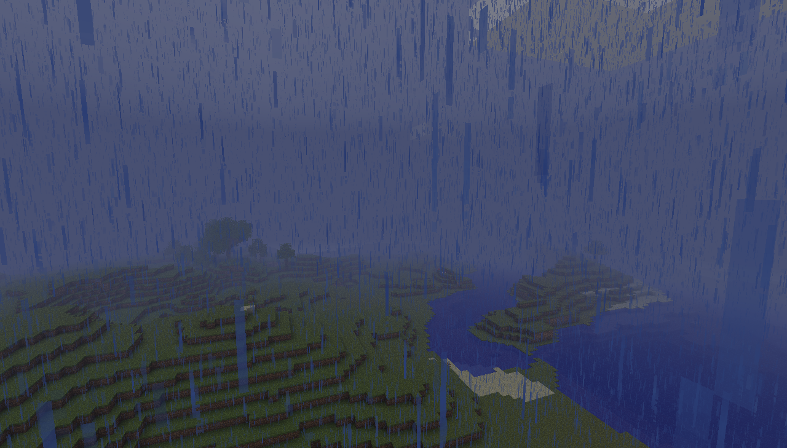

# McBetaCpp: C++ Port of Minecraft Beta 1.7.3

Высокопроизводительный кроссплатформенный программный комплекс, представляющий собой нативный порт легендарной версии игры Minecraft Beta 1.7.3. Проект полностью переписан на C++ с использованием мультимедийной библиотеки SDL2 и графического API OpenGL. Главная цель проекта — сохранение классического игрового опыта с многократным увеличением производительности за счет отказа от виртуальной машины Java (JVM) и прямого доступа к аппаратному обеспечению.



---

## Обзор технологий и возможностей

### Аутентичный воксельный движок
В основе проекта лежит оригинальная математика и физика Minecraft Beta 1.7.3, бережно перенесенная на C++. Движок обеспечивает побитовую точность генерации мира, физики жидкостей (воды и лавы) и поведения мобов. Благодаря нативной компиляции, потребление оперативной памяти снижено в несколько раз по сравнению с Java-оригиналом, а частота кадров остается стабильной даже на слабом оборудовании.


### Творческий режим (Creative Mode)
В движок аккуратно интегрирован режим Creative, который отсутствовал в ванильной Java-версии Beta 1.7.3. Вы можете наслаждаться классической генерацией миров со всеми удобствами бесконечного инвентаря и свободного полета.
Для переключения между режимами пропишите в чат /gamemode1 также если вам нужны специфические блоки выдайте их командой /give id_блока

### Интегрированный WorldEdit (SPC)
Для удобного строительства и редактирования ландшафта в проект встроена система Single Player Commands (SPC). Вам доступен тот самый легендарный деревянный топорик для выделения регионов и мгновенного изменения карты прямо в игре с помощью знакомых команд (например, массовая замена блоков через `//set`).



### Мультиплеер и Игра по сети
Клиент полностью поддерживает сетевую игру и способен подключаться к стандартным серверам Minecraft Beta 1.7.3. Вы можете играть с друзьями через локальную сеть или использовать виртуальные сети (например, Radmin VPN или Hamachi).

**Как создать свой сервер для игры:**
1. Скачайте оригинальный Java-сервер для нужной версии (файл `minecraft_server.jar` для Beta 1.7.3).
2. Поместите его в пустую папку и запустите один раз. Дождитесь создания файлов и закройте сервер.
3. Откройте появившийся файл `server.properties` через любой текстовый редактор.
4. Обязательно измените строку `online-mode=true` на **`online-mode=false`** (иначе сервер не пустит C++ клиент без официальной авторизации Mojang).
5. Убедитесь, что строка `server-ip=` пустая.
6. Снова запустите сервер. Теперь в игре вы можете зайти в Multiplayer и подключиться по адресу `localhost` (если играете с того же ПК) или дать друзьям свой IP-адрес.





### Нативная кроссплатформенность и архитектура
Проект использует гибкую систему CMake и абстракции SDL2, что позволяет компилировать код под множество операционных систем без внесения изменений в базовую логику. Поддерживаются:
*   **Windows:** Нативная сборка через MSVC или MinGW.
*   **Linux :** Оптимизировано для работы на ARM-архитектурах, включая маломощные одноплатные компьютеры (RPi Zero 2 W) благодаря использованию OpenGL 1.5 / OpenGL ES.
*   **Android:** Полноценная поддержка мобильных устройств.

### Адаптивный графический конвейер (Tesselator)
Система рендеринга основана на кастомной реализации класса `Tesselator`. Графический конвейер собирает воксельную геометрию чанков в массивы вершин (Vertex Arrays) и буферы (VBO), минимизируя количество вызовов отрисовки (Draw Calls). Реализована поддержка:
*   Динамического освещения и затенения (Ambient Occlusion).
*   Классического тумана (Fixed-function fog).
*   Сглаживания текстур и альфа-тестирования для листвы и воды.



### Интегрированное сенсорное управление (Android/Touch)
В движок встроен интеллектуальный модуль перехвата сенсорного ввода (`SDL_FINGER`). При компиляции под мобильные платформы экран делится на интерактивные зоны:
*   Левая полусфера работает как виртуальный D-Pad (крестовина) для перемещения и прыжков.
*   Правая полусфера отвечает за плавное управление камерой (Look) и взаимодействие с блоками.
На десктопных системах этот модуль автоматически отключается на этапе препроцессинга (`#ifdef __ANDROID__`), сохраняя кристальную чистоту ПК-версии.


## Управление и интерактив

Интерфейс управления полностью соответствует классическим стандартам ПК-гейминга, но имеет ряд дополнительных системных привязок:

| Клавиша / Действие | Функционал в движке |
| :--- | :--- |
| **W, A, S, D** | Перемещение персонажа в пространстве |
| **Space (Пробел)** | Прыжок |
| **Мышь (ЛКМ / ПКМ)** | Разрушение блоков / Установка блоков (Взаимодействие) |
| **Колесо мыши** | Прокрутка слотов инвентаря (Hotbar) |
| **E / I** | Открытие инвентаря персонажа |
| **F11** | Мгновенное переключение в полноэкранный режим (Fullscreen) |
| **F5** | Переключение вида от 3-го лица |
| **F2** | Создание скриншота (сохраняется в папку игры) |

---

## Зависимости и сборка

### Сборка на ОС Windows
Проект поставляется с готовыми конфигурациями для IDE CLion и Visual Studio. Все внешние зависимости (SDL2, zlib, OpenAL, glad) линкуются автоматически или включены в состав репозитория.
1. Откройте директорию проекта в вашей IDE.
2. Установите профиль сборки `Release`.
3. Нажмите `Build`. Для сокрытия консольного окна при запуске используется флаг `WIN32` в `CMakeLists.txt`.

### Сборка на ОС Linux
Для успешной компиляции требуются компилятор C++, CMake и пакеты SDL2:

```bash
sudo apt-get update
sudo apt-get install build-essential cmake libsdl2-dev libgl1-mesa-dev libx11-dev

mkdir build && cd build
cmake -DCMAKE_BUILD_TYPE=Release ..
make -j4
./McBetaCpp
```

*Для Raspberry Pi рекомендуется использовать OpenGL драйвер `vc4/v3d` (Mesa) и выделить минимум 128 МБ памяти для GPU.*

---

## Лицензия и Авторское право

> **ВАЖНО:** Данный проект является неофициальным портом (производной работой).
Все права на оригинальный исходный код Java, торговую марку "Minecraft", а также на все медиа-активы (текстуры, 3D-модели, звуковые эффекты и музыку) принадлежат **Mojang AB** и **Microsoft Corporation**.

Данный исходный код движка (C++) предоставляется исключительно в образовательных, исследовательских и ознакомительных целях. Разработчики порта не претендуют на авторство оригинальной игры. 

Пользователям необходимо иметь легально приобретенную копию Minecraft для извлечения оригинальных файлов ресурсов (`resource/`, `img/`), необходимых для работы этого программного обеспечения.
